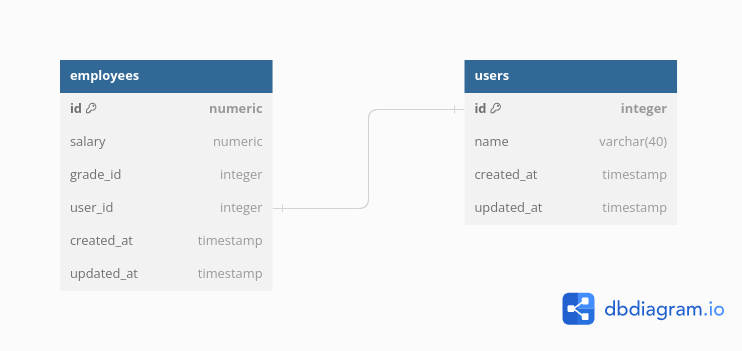

# Employee CRUD Tech Docs


## Preface


Following are documentation of the employee CRUD apps. The documentation are consist of :

- Database Structure
- API Documentations

## Database


Database are using PostgreSQL 15.4. The following are ERD (Entity Relationship Diagram) to explain how entity are
structured and how are relationship between them.



Every entity would have created_at and updated_at for auditing reasons.
It's most useful for tracing bugs. Product Ops sometimes need this.
The types would be timestamp using UTC zoned times.

Table: users

This table is for every user needs in general. Credentials can be added later to this table or even ban systems.

| Name | Type        | Description                  |
|------|-------------|------------------------------|
| id   | int8        | Primary Key, auto increment. |
| name | varchar(40) | The name of the users        |

Table: employees

This table contains information of employee.

| Name     | Type    | Description                                                                                                                                                                                                                                   |
|----------|---------|-----------------------------------------------------------------------------------------------------------------------------------------------------------------------------------------------------------------------------------------------|
| id       | numeric | Primary Key. Id of the employee, the value are declared by users.                                                                                                                                                                             |
| grade_id | int4    | Employee grade id. It's explain the employee grades in 1 organizations. The text value are being declared on code. The grade id are statically mapped as follow. (grade_id:grade_name) <br/>- 1: Manager<br/>- 2: Supervisor<br/>- 3: Manager |
| user_id  | int8    | Foreign key for table users.                                                                                                                                                                                                                  |
| salary   | numeric | Salary of the employee. numeric is big integer representation in postgres because it can store number with a lot of digits                                                                                                                    |

## API Docs


The base response are as follows :

```json
{
  "data": null,
  "error": {
    "code": "ERROR_CODE",
    "message": "error code"
  }
}
```

`data` should be filled with JSON of the resource when http status is `200 OK`, the error is null at this state.
`error` object are filled when HTTP status not `2xx`. `error.code` is use for showing error state in apps.
`error.message` is use for explain more of `error.code`.

If request payload is invalid the response are as follows:
```json
{
    "data": null,
    "error": {
        "message": "Invalid request content.",
        "code": "INVALID_REQUEST_PAYLOAD"
    }
}
```

### Create Employee

Path:

```
POST BASE_URL/employees
```

Request:

```json
{
  "id": 243205,
  "name": "test",
  "gradeId": 1,
  "salary": 7563000
}
```

| Name    | Type    | Description                                                           |
|---------|---------|-----------------------------------------------------------------------|
| id      | Integer | Id of the employee. required. should be positive. min 1               |
| name    | String  | Name of the employee. required. minimum length is 1 and maximum is 40 |
| gradeId | Integer | Id of the employee grad. required. min 1 and max 3.                   |
| salary  | Integer | Salary of the employee. required. min 1                               |

Response:

200 OK
```json
{
    "data": {
        "id": 243
    },
    "error": null
}
```

Employee Duplicate 409 Conflict
```json
{
    "data": null,
    "error": {
        "message": "User duplicate",
        "code": "EMPLOYEE_DUPLICATE"
    }
}
```


### Update Employee

Path:
```
PUT BASE_URL/employees/{id}
```


Request:

```json
{
  "id": 243205,
  "name": "test",
  "gradeId": 1,
  "salary": 7563000
}
```

| Name    | Type    | Description                                                           |
|---------|---------|-----------------------------------------------------------------------|
| id      | Integer | Id of the employee. required. should be positive. min 1               |
| name    | String  | Name of the employee. required. minimum length is 1 and maximum is 40 |
| gradeId | Integer | Id of the employee grad. required. min 1 and max 3.                   |
| salary  | Integer | Salary of the employee. required. min 1                               |

Response:

200 OK
```json
{
    "data": {
        "id": 243
    },
    "error": null
}
```


Employee Duplicate 409 Conflict
```json
{
    "data": null,
    "error": {
        "message": "User duplicate",
        "code": "EMPLOYEE_DUPLICATE"
    }
}
```

Employee Not Found 404 Not Found
```json
{
    "data": null,
    "error": {
        "message": "Employee not found",
        "code": "EMPLOYEE_NOT_FOUND"
    }
}
```

### Get By Employee By Id
Path:
```
GET BASE_URL/employees/{id}
```

Response:

200 OK

```json
{
    "data": {
        "id": 243201,
        "name": "testa",
        "salary": 7563000,
        "gradeCode": "1:Manager",
        "totalBonus": 8319300.0
    },
    "error": null
}
```


Employee Not Found 404 Not Found
```json
{
    "data": null,
    "error": {
        "message": "Employee not found",
        "code": "EMPLOYEE_NOT_FOUND"
    }
}
```


### Paginate Employee

Path:
```
GET BASE_URL/employees
```

Query Params:

- page : page of the resource, starting from 1. if null default 1.
- limit : total of the resource got. if null defaulf 5.

Response:

200 OK
```json
{
    "data": [
        {
            "id": 243201,
            "name": "testa",
            "salary": 7563000,
            "gradeCode": "1:Manager",
            "totalBonus": 8319300.0
        },
        {
            "id": -243201,
            "name": "test",
            "salary": 7563000,
            "gradeCode": "1:Manager",
            "totalBonus": 8319300.0
        },
        {
            "id": 243205,
            "name": "test",
            "salary": 7563000,
            "gradeCode": "1:Manager",
            "totalBonus": 8319300.0
        },
        {
            "id": 243,
            "name": "test",
            "salary": 7563000,
            "gradeCode": "1:Manager",
            "totalBonus": 8319300.0
        }
    ],
    "error": null
}
```